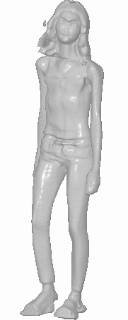
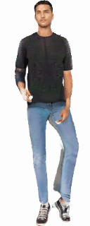
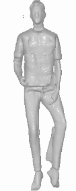
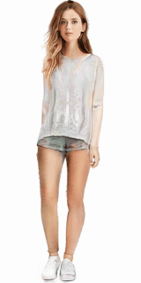

<div align="center">

<h1>EVA3D: Compositional 3D Human Generation from 2D Image Collections</h1>

<div>
    <a href='https://hongfz16.github.io/' target='_blank'>Fangzhou Hong</a>&emsp;
    <a href='https://frozenburning.github.io/' target='_blank'>Zhaoxi Chen</a>&emsp;
    <a href='https://github.com/NIRVANALAN' target='_blank'>Yushi Lan</a>&emsp;
    <a href='https://scholar.google.com/citations?user=lSDISOcAAAAJ&hl=zh-CN' target='_blank'>Liang Pan</a>&emsp;
    <a href='https://liuziwei7.github.io/' target='_blank'>Ziwei Liu</a><sup>*</sup>
</div>
<div>
    S-Lab, Nanyang Technological University&emsp; <sup>*</sup>corresponding author
</div>

<div>
    :star_struck: <strong>Accepted to ICLR 2023 as Spotlight</strong>
</div>

<div>
<a target="_blank" href="https://colab.research.google.com/github/hongfz16/EVA3D/blob/main/notebook/EVA3D_Demo.ipynb">
  
</a>
<a target="_blank" href="https://huggingface.co/spaces/hongfz16/EVA3D">
  
</a>
<a href="https://hits.seeyoufarm.com"></a>
</div>

<strong>EVA3D is a high-quality unconditional 3D human generative model that only requires 2D image collections for training.</strong>

<table>
<tr>
    <td></td>
    <td></td>
    <td></td>
    <td></td>
    <td></td>
    <td></td>
</tr>
<tr>
    <td align='center' width='14%'>Sample 1 RGB</td>
    <td align='center' width='14%'>Sample 1 Geo</td>
    <td align='center' width='14%'>Sample 2 RGB</td>
    <td align='center' width='14%'>Sample 2 Geo</td>
    <td align='center' width='19%'>Novel Pose Generation</td>
    <td align='center' width='19%'>Latent Space Interpolation</td>
</tr>
</table>

:open_book: For more visual results, go checkout our <a href="https://hongfz16.github.io/projects/EVA3D.html" target="_blank">project page</a>

<!-- This repository will contain the official implementation of _EVA3D: Compositional 3D Human Generation from 2D Image Collections_. -->
:beers: Training and Inference codes released

---

<h4 align="center">
  <a href="https://hongfz16.github.io/projects/EVA3D.html" target='_blank'>[Project Page]</a> •
  <a href="https://arxiv.org/abs/2210.04888" target='_blank'>[arXiv]</a> •
  <a href="https://youtu.be/JNV0FJ0aDWM" target='_blank'>[Demo Video]</a> •
  <!-- <a href="https://colab.research.google.com/drive/1k6-Sc_EsIT292hNgu-7haC5ghggImQ7f?usp=sharing" target='_blank'>[Colab Demo]</a> -->
  <a href="https://colab.research.google.com/github/hongfz16/EVA3D/blob/main/notebook/EVA3D_Demo.ipynb" target='_blank'>[Colab Demo]</a> •
  <a href="" target='_blank'>[Hugging Face :hugs:]</a>
</h4>

</div>

## :mega: Updates
[02/2023] Inference codes for SHHQ, UBCFashion and AIST are released.

[02/2023] Training codes for DeepFashion with our processed dataset are released.

[02/2023] Inference codes (512x256 generation on DeepFashion) are released, including colab and huggingface demos.

[01/2023] EVA3D is accepted to ICLR 2023 (Spotlight):partying_face:!

## :love_you_gesture: Citation
If you find our work useful for your research, please consider citing the paper:
```
@inproceedings{
    hong2023evad,
    title={{EVA}3D: Compositional 3D Human Generation from 2D Image Collections},
    author={Fangzhou Hong and Zhaoxi Chen and Yushi LAN and Liang Pan and Ziwei Liu},
    booktitle={International Conference on Learning Representations},
    year={2023},
    url={https://openreview.net/forum?id=g7U9jD_2CUr}
}
```

## :desktop_computer: Requirements

NVIDIA GPUs are required for this project.
We have test the inference codes on NVIDIA RTX2080Ti, NVIDIA V100, NVIDIA A100, NVIDIA T4.
The training codes have been tested on NVIDIA V100, NVIDIA A100.
We recommend using anaconda to manage the python environments.

```bash
conda create --name eva3d python=3.8
conda install pytorch==1.7.1 torchvision==0.8.2 torchaudio==0.7.2 cudatoolkit=10.1 -c pytorch
conda install -c fvcore -c iopath -c conda-forge fvcore iopath
conda install pytorch3d -c pytorch3d
pip install -r requirements.txt
```

## :running_woman: Inference

### Download Models

The pretrain model and SMPL model are needed for inference.

The following script downloads pretrain models.

```bash
python download_models.py
```

Register and download SMPL models [here](https://smpl.is.tue.mpg.de/). Put the downloaded models in the folder smpl_models. Only the neutral one is needed. The folder structure should look like

```
./
├── ...
└── smpl_models/
    ├── smpl/
        └── SMPL_NEUTRAL.pkl
```

### Commands

We provide a script for inference the model trained on DeepFashion, SHHQ, UBCFashion, AIST.

```bash
bash scripts/demo_deepfashion_512x256.sh
bash scripts/demo_shhq_512x256.sh
bash scripts/demo_ubcfashion_512x256.sh
bash scripts/demo_aist_256x256.sh
```

## :train: Training

### DeepFashion

#### Download SMPL Models & Processed Datasets

```bash
python download_models.py
python download_datasets.py
```

#### Commands

```bash
bash scripts/train_deepfashion_512x256.sh
```

Intermediate results will be saved under `checkpoint/train_deepfashion_512x256/volume_renderer/samples` every 100 iterations. The first line presents inference images from EMA generator. The second line present one inference sample of the training generator and one sample from the training dataset.

To inference the trained models, please refer to the **Inference** section.

Support for more datasets coming soon...

## :newspaper_roll: License

Distributed under the S-Lab License. See `LICENSE` for more information.

## :raised_hands: Acknowledgements

This study is supported by NTU NAP, MOE AcRF Tier 2 (T2EP20221-0033), and under the RIE2020 Industry Alignment Fund – Industry Collaboration Projects (IAF-ICP) Funding Initiative, as well as cash and in-kind contribution from the industry partner(s).

This project is built on source codes shared by [StyleSDF](https://github.com/royorel/StyleSDF).
